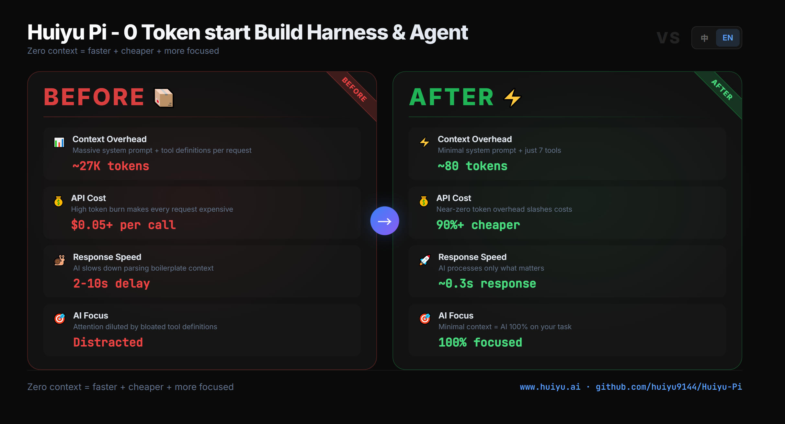

<p align="center">
  
</p>

<h1 align="center">Huiyu Pi</h1>

<p align="center"><a href="https://www.huiyu.ai">www.huiyu.ai</a></p>

<p align="center">
  <a href="README.md">🇺🇸 English</a> · <a href="README.zh.md">🇨🇳 中文</a> · <a href="README.ja.md">🇯🇵 日本語</a> · <a href="README.ko.md">🇰🇷 한국어</a> · <a href="README.es.md">🇪🇸 Español</a> · <a href="README.fr.md">🇫🇷 Français</a> · <a href="README.de.md">🇩🇪 Deutsch</a> · <a href="README.pt.md">🇧🇷 Português</a> · <a href="README.ru.md">🇷🇺 Русский</a> · <a href="README.ar.md">🇸🇦 العربية</a>
</p>

<p align="center">
  
  
  
  
  
  
  
  
  
</p>

<p align="center">
  <b>وكيل برمجة ذكاء اصطناعي، مُبسَّط لأقصى حد.</b><br>
  ~80 رمزًا في الإرشادات النظامية · ~0.3 ثانية لأول رمز · 4 أدوات أساسية · 100% محلي
</p>

<p align="center" style="max-width:800px;margin:0 auto;color:#64748b;font-size:12px;line-height:1.6;">
  Huiyu Pi واجهة ويب، أداة وكيل محلية مفتوحة المصدر تتيح لك <b style="color:#00d4aa;">بناء نظام Harness خاص بك من الصفر</b>.
  مبنية على Pi و pi-forge، مقارنة بأدوات IDE مثل Codex و Claude Code،
  <b style="color:#00d4aa;">يُقلَّص السياق إلى ما يقارب الصفر مع تحسن هائل في السرعة</b>.
  ابنِ بوضوح دون قيود المنصات.
</p>

<table>
  <tr>
    <td width="100%"></td>
  </tr>
  <tr>
    <td width="100%"></td>
  </tr>
</table>

<table>
  <tr>
    <td width="50%"></td>
    <td width="50%"></td>
  </tr>
  <tr>
    <td width="50%"></td>
    <td width="50%"></td>
  </tr>
</table>

---

## لماذا ~80 رمزًا؟

معظم أدوات البرمجة بالذكاء الاصطناعي تضمن 15,000–28,000 رمزًا في كل طلب — القواعد، تعريفات الأدوات، إرشادات الأدوار، وتنسيق المخرجات. يقضي الذكاء الاصطناعي معظم انتباهه على قراءة النصوص الجاهزة بدلاً من حل مشكلتك.

Huiyu Pi يسلك النهج المعاكس: إزالة كل ما ليس ضروريًا. 4 أدوات أساسية. لوحة نظيفة. بدون أثقال.

| | قبل (الحالة النموذجية) | Huiyu Pi |
|---|---|---|
| حمل الإرشادات النظامية | 15K–28K رمزًا | **~80 رمزًا** |
| وقت استجابة أول رمز | 2–10 ثوانٍ | **~0.3 ثانية** |
| تكلفة كل طلب | $0.02–$0.10+ | **أقل بأكثر من 90%** |
| تعريفات الأدوات | 10–24+ | **4 أساسية** |
| نوع العميل | سطح مكتب ثقيل / Electron | **واجهة ويب نقية** |
| خصوصية البيانات | سحابي أو هجين | **100% محلي** |

---

## لماذا تختار Huiyu Pi؟

مبنية على pi و pi-forge، تُصلح نقصهما في واجهة ويب وتفاصيل التفاعل الصعبة. Huiyu Pi هي واجهة ويب متصفحية لوكيل البرمجة pi — سريعة للغاية وممتعة في الاستخدام — ولهذا أشاركها.

| | الميزة | التفاصيل |
|---|---|---|
| ⚡ | **أداء أسرع** | السياق والإرشادات الافتراضية مضغوطة من ~20K رمزًا إلى ما يقارب الصفر. وقت استجابة الذكاء الاصطناعي أقصر بشكل ملحوظ. |
| 💰 | **استهلاك أقل للرموز** | إزالة معظم السياق غير المستخدم، مما يقلل بشكل كبير تكلفة API لكل طلب. |
| 🎯 | **سياق أقل، تركيز أكثر** | سياق أقل = يظل الذكاء الاصطناعي مركّزًا على الإرشادات الأساسية لتنفيذ أكثر دقة. |
| 🔒 | **النشر المحلي = أمان** | محلي بالكامل — مفاتيح API والبيانات لا تغادر جهازك أبدًا. صفر مخاطر تسريب البيانات. |
| 🏗️ | **ابنِ إمبراطوريتك في الذكاء الاصطناعي** | ابنِ نظام Harness ووكيل خاص بك من الصفر. تحكم كامل، قابل للتعديل بالكامل. |
| 🛠️ | **إصلاح ثغرات المشروع الأصلي** | يُصلح نقص pi في WebUI ومشاكل تفاعل pi-forge. سريع للغاية، سلس بشكل لا يُصدق. |

---

## البدء السريع

```bash
npx huiyu-pi
```

افتح `http://localhost:9144` في متصفحك، انتقل إلى **الإعدادات ← المزودون**، أدخل مفتاح API الخاص بك، وابدأ المحادثة.

*متاح أيضًا كتثبيت عام عبر npm، أو استنساخ يدوي، أو سكريبتات المنصات — راجع [التثبيت](#التثبيت) أدناه.*

---

## المميزات

### 🔐 استضافة ذاتية وخصوصية
كودك ومفاتيح API وسجل المحادثات تبقى على جهازك. لا سحابة، لا أطراف ثالثة، لا تسريب بيانات.

### 🧠 دعم متعدد لنماذج اللغة الكبيرة
يعمل مع Anthropic Claude، OpenAI GPT/o1/o3، DeepSeek، Google Gemini، Mistral، Groq، xAI، OpenRouter، والمزيد — بما في ذلك النماذج المحلية.

### 📁 إدارة ملفات كاملة
مستعرض ملفات مدمج مع محرر CodeMirror يدعم أكثر من 10 لغات. أنشئ وحرر وابحث عن الملفات مباشرة في المتصفح.

### 🖥️ طرفية متكاملة
محاكاة طرفية كاملة عبر xterm.js + WebSocket. تبويبات متعددة، دعم إعادة الاتصال، تخطيط قابل للتعديل.

### 🔀 تكامل Git
عرض الفروقات، تجهيز التغييرات على مستوى الأجزاء، استكشاف سجل提交 مع git-graph — كل ذلك من المتصفح.

### 🔌 دعم بروتوكول MCP
اتصل بخوادم MCP الكاشفة واعرض أدواتها لوكيل البرمجة الخاص بك. يدعم الإعدادات العامة ومستوى المشروع.

### 📱 متوافق مع الأجهزة المحمولة + PWA
تصميم متجاوب يعمل على iOS/Android. ثبّته كتجربة PWA لتجربة أقرب للتطبيقات الأصلية.

### 🎨 سمة قابلة للتعديل بالكامل
سمات الفاتح والداكن تتحكم فيها متغيرات CSS. أنشئ السمة الخاصة بك دون إعادة البناء.

---

## التثبيت

**المتطلبات الأساسية:** Node.js ≥ 20 ([تنزيل](https://nodejs.org/)). أدوات البناء مطلوبة لدعم الطرفية: ثبّت [Visual Studio Build Tools](https://visualstudio.microsoft.com/visual-cpp-build-tools/) (ويندوز)، أو `xcode-select --install` (macOS)، أو `build-essential` (Linux). المحادثة ومستعرض الملفات يعملان بدون أدوات البناء — تبويب الطرفية فقط يحتاجهما.

### الخيار أ: npx (بدون تثبيت، تشغيل لمرة واحدة)

```bash
npx huiyu-pi
```

يُنزِّل ويُشغّل أحدث إصدار. استدعاءات `npx huiyu-pi` اللاحقة تستخدم النسخة المخزّنة. للإجبار على التحديث: `npx huiyu-pi@latest`.

### الخيار ب: تثبيت عام (إطلاق أسرع في المرة التالية)

```bash
npm install -g huiyu-pi
huiyu-pi                    # تشغيل الخادم
huiyu-pi --help             # عرض جميع الخيارات
huiyu-pi --port 4000        # منفذ مخصص
huiyu-pi --workspace-path ~/Code  # مساحة عمل مخصصة
```

للتحديث: `npm update -g huiyu-pi`. للإلغاء: `npm uninstall -g huiyu-pi`.

### الخيار ج: سكريبتات المنصات (استنساخ + تشغيل)

استنسخ المستودع، ثم شغّل سكريبت البدء الخاص بمنصتك:

| المنصة | الأمر |
|---|---|
| **ويندوز** | انقر نقرًا مزدوجًا على `start.bat`، أو نفّذ في PowerShell: `.\start.bat` |
| **macOS / Linux** | افتح الطرفية، انتقل إلى المستودع بـ `cd`، ثم `bash start.sh` |

سكريبت البدء يتولى كل شيء: `npm install` → بناء الخادم → بناء العميل → التشغيل. التشغيل الأول يستغرق بضع دقائق؛ التشغيلات اللاحقة سريعة.

**الوصول من الشبكة المحلية** (مشاركة على شبكتك المحلية):

| المنصة | الأمر |
|---|---|
| **ويندوز** | `.\start-lan.bat` |
| **macOS / Linux** | `bash start-lan.sh` |

أو عبر الخيار: `huiyu-pi --host 0.0.0.0`

> ⚠️ **الأمان:** ربط `0.0.0.0` يكشف شل الوكيل ونظام الملفات لـ **جميع أجهزة شبكتك**. استخدمه فقط على شبكات خاصة موثوقة.

### الخيار د: يدوي (للتطوير)

```bash
git clone https://github.com/huiyu9144/Huiyu-Pi.git
cd Huiyu-Pi
npm install          # تثبيت جميع التبعيات (قد يستغرق بضع دقائق في المرة الأولى)
npm run dev          # تشغيل خادم التطوير مع HMR (http://localhost:9145)
```

لبناء الإنتاج:

```bash
npm run build        # بناء الخادم + العميل
npm run start        # تشغيل خادم الإنتاج على المنفذ 9144
```

### الخيار هـ: Docker (موصى به للإنتاج)

**سحب من السجل** (لا حاجة للاستنساخ):
```bash
docker run -d \
  --name huiyu-pi \
  -p 9144:9144 \
  -v ~/.pi/agent:/home/pi/.pi/agent \
  -v ~/.huiyu-pi:/home/pi/.huiyu-pi \
  -v $(pwd)/workspace:/workspace \
  ghcr.io/huiyu9144/huiyu-pi:latest
```

**أو البناء محليًا** (للتعديل):
```bash
git clone https://github.com/huiyu9144/Huiyu-Pi.git
cd Huiyu-Pi/docker
cp .env.example .env
docker compose up -d --build
```

افتح `http://localhost:9144` في متصفحك.

**معرّف مستخدم ومجموعة مخصص** (إصلاح مشاكل الصلاحيات على الوصلات المرتبطة):
```bash
docker compose build --build-arg PUID=$(id -u) --build-arg PGID=$(id -g)
docker compose up -d
```

لإعداد Docker التفصيلي، راجع [docker/README.md](docker/README.md).

---

## إعداد مفتاح API

يدير Huiyu Pi مفاتيح API الخاصة بالمزودين من خلال **واجهة الإعدادات** ويُخزّنها في `~/.pi/agent/auth.json` (تُشارك مع واجهة سطر أوامر `pi` إذا كانت مُثبّتة). المفاتيح لا تُكشف أبدًا للمتصفح — الخادم يُبقيها في الذاكرة ويُوجّه جميع طلبات LLM.

### من واجهة الإعدادات (الموصى به)

1. افتح `http://localhost:9144`
2. انتقل إلى **الإعدادات ← المزودون**
3. اختر مزودك (Anthropic، OpenAI، DeepSeek، إلخ)
4. الصق مفتاح API الخاص بك واحفظه

### المزودون المدعومون

Anthropic Claude، OpenAI GPT/o1/o3، DeepSeek، Google Gemini، Mistral، Groq، xAI، OpenRouter، وأي نقطة نهاية متوافقة مع OpenAI (vLLM، LiteLLM، Ollama، إلخ).

### مزودون مخصصون متوافقون مع OpenAI

لنقاط النهاية المضيفة ذاتيًا أو التابعة لجهات أخرى، أنشئ `~/.pi/agent/models.json`:

```json
{
  "custom-gateway": {
    "protocol": "openai",
    "url": "http://localhost:11434/v1",
    "models": ["qwen2.5-coder-32b"]
  }
}
```

ثم أضف مفتاح API في **الإعدادات ← المزودون ← custom-gateway**.

### خيار سطر الأوامر (للسكريبتات / CI)

```bash
huiyu-pi --api-key @/path/to/api-key.txt
```

البادئة `@` تقرأ المفتاح من ملف. مفيد لخطوط CI وأسرار Docker.

---

## الإعدادات

يمكن التحكم في جميع الإعدادات عبر خيارات سطر الأوامر، أو متغيرات البيئة، أو ملفات الإعدادات. خيارات سطر الأوامر لها الأولوية على متغيرات البيئة، التي لها الأولوية على ملفات الإعدادات.

### خيارات سطر الأوامر

| الخيار | الوصف | القيمة الافتراضية |
|---|---|---|
| `--port` | منفذ الخادم | `9144` |
| `--host` | عنوان الربط | `127.0.0.1` |
| `--workspace-path` | المجلد الجذري للمشاريع | `~/huiyu-pi-workspace` |
| `--api-key` | مفتاح API ثابت (يُدعم صيغة `@file`) | — |
| `--ui-password` | كلمة مرور تسجيل الدخول في المتصفح | — |
| `--jwt-secret` | مفتاح توقيع JWT (يُولّد تلقائيًا إذا لم يُعيَّن) | — |
| `--log-level` | مستوى السجل: `fatal` `error` `warn` `info` `debug` `trace` | `info` |
| `--no-expose-docs` | إخفاء Swagger UI عن المتصفح | الوثائق مكشوفة |
| `--help` | عرض جميع الخيارات | — |

### متغيرات البيئة

| المتغير | الوصف |
|---|---|
| `PORT` | منفذ الخادم |
| `HOST` | عنوان الربط (`0.0.0.0` للشبكة المحلية) |
| `WORKSPACE_PATH` | المجلد الجذري للمشاريع |
| `API_KEY` | مفتاح API ثابت |
| `UI_PASSWORD` | كلمة مرور تسجيل الدخول في المتصفح |
| `JWT_SECRET` | مفتاح توقيع JWT |
| `LOG_LEVEL` | مستوى السجل |
| `EXPOSE_DOCS` | اضبط على `false` لإخفاء Swagger UI |
| `FORGE_DATA_DIR` | تجاوز دليل الحالة (الافتراضي `~/.huiyu-pi/`) |

### ملفات الإعدادات

| الملف | الغرض |
|---|---|
| `~/.pi/agent/auth.json` | مفاتيح API للمزودين (تُدار عبر واجهة الإعدادات) |
| `~/.pi/agent/settings.json` | إعدادات الوكيل (النموذج، مستوى التفكير، إلخ) |
| `~/.pi/agent/models.json` | مزودون مخصصون متوافقون مع OpenAI |
| `~/.huiyu-pi/mcp.json` | إعدادات خادم MCP العامة |

---

## التخصيص

تتحكم السمة بخصائص CSS المخصصة في `packages/client/src/index.css`:

```css
:root {
  --bg-primary: #0a0a0a;
  --accent: #60A5FA;
}

html[data-theme="light"] {
  --bg-primary: #ffffff;
  --accent: #2563EB;
}
```

---

## حزمة التقنيات

| الطبقة | التقنيات |
|-------|-------------|
| **الواجهة الأمامية** | React 19، TypeScript 6، Vite 8، Tailwind CSS v4، Zustand، CodeMirror 6 |
| **الخادم** | Fastify 5، WebSocket، SSE، JWT |
| **الطرفية** | xterm.js + node-pty |
| **البنية التحتية** | GitHub Actions CI/CD |

---

## المجتمع

- 💬 [انضم إلى ديسكوردنا](https://discord.gg/BdJDs4AKbS)
- ⭐ [أضف نجمة لنا على GitHub](https://github.com/huiyu9144/Huiyu-Pi)
- 🌐 [زُر موقعنا الرسمي](https://www.huiyu.ai)

---

## المساهمة

نرحّب بالمساهمات! راجع [CONTRIBUTING.md](CONTRIBUTING.md) للإرشادات.

---

## الشكر والتقدير

مبني على مشاريع مفتوحة المصدر:

- [**pi-forge**](https://github.com/Devin-Marks/pi-forge) بواسطة [Devin Marks](https://github.com/Devin-Marks) والمساهمون
- [**pi**](https://github.com/earendil-works/pi) بواسطة [earendil-works](https://github.com/earendil-works) والمساهمون

## المؤلف

تابع المؤلف على X (تويتر): [@huiyu91444](https://x.com/huiyu91444)

## الرخصة

[MIT](LICENSE) — راجع المشاريع الأصلية لرخصها:
- [pi-forge](https://github.com/Devin-Marks/pi-forge)
- [pi](https://github.com/earendil-works/pi)

حقوق النشر © 2026 مساهمو Huiyu Pi
حقوق النشر © 2026 Devin Marks ومساهمو pi-forge
حقوق النشر © 2026 earendil-works ومساهمو pi
