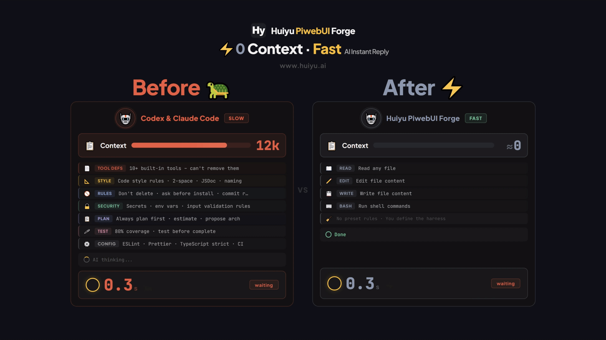
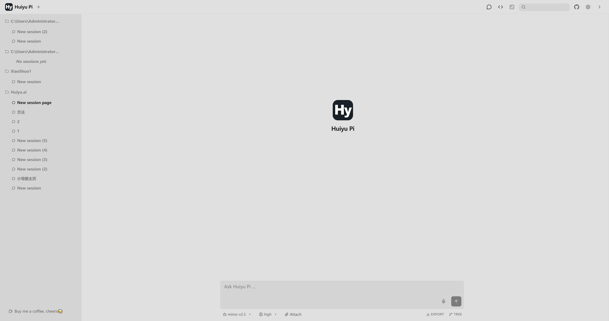
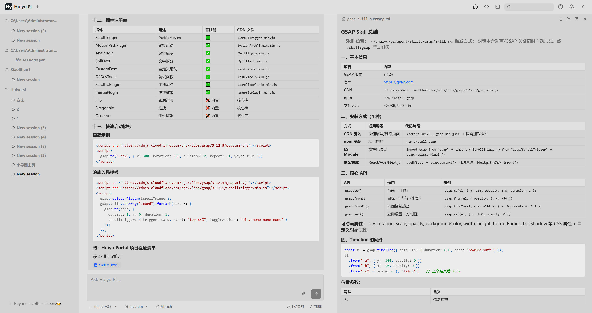
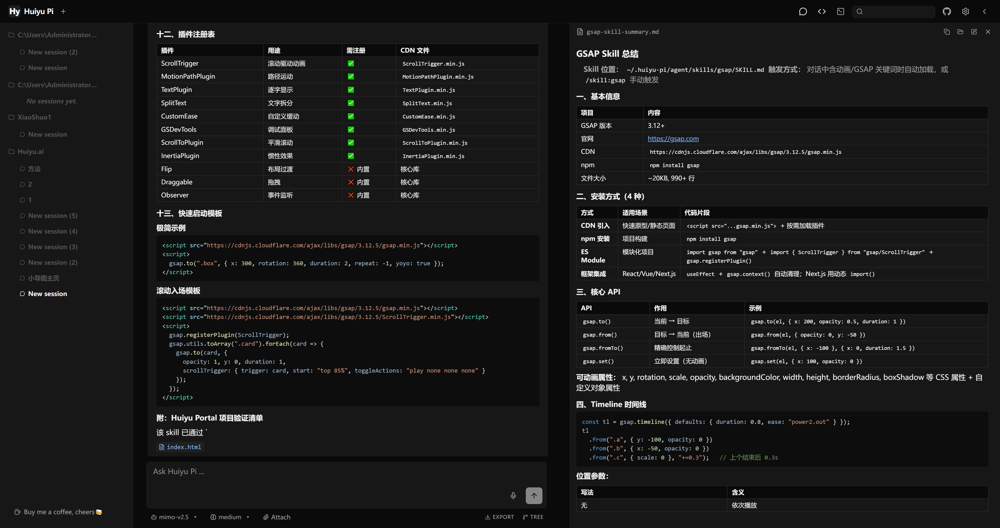

<p align="center">
  
</p>

<h1 align="center">Huiyu Pi</h1>

<p align="center">
  <a href="README.md">🇬🇧 English</a> · <a href="https://www.huiyu.ai">🌐 官网</a>
</p>

<p align="center">
  <b>完全免费 · 开源 · 自托管</b><br>
  一个本地开源的 Agent 工具，可以从 0 搭建自己的 Harness 系统。<br>
  基于 Pi 和 pi-forge 打造 — <b>上下文减少到接近 0，速度提升巨大</b>。<br>
  Pi 编码代理的浏览器端 WebUI 前端。从 0 搭建更加干净，无需受限于平台。
</p>

<p align="center">
  <a href="https://discord.gg/BdJDs4AKbS"></a>
  <a href="https://github.com/huiyu9144/Huiyu-Pi/stargazers"></a>
  <a href="https://github.com/huiyu9144/Huiyu-Pi/network/members"></a>
  <a href="https://github.com/huiyu9144/Huiyu-Pi/blob/main/LICENSE"></a>
  <a href="https://github.com/huiyu9144/Huiyu-Pi/releases"></a>
  <a href="https://github.com/huiyu9144/Huiyu-Pi/issues"></a>
</p>

<p align="center">
  <i>基于 <a href="https://github.com/Devin-Marks/pi-forge">pi-forge</a> 和 <a href="https://github.com/earendil-works/pi">pi</a> 构建。</i>
</p>

<p align="center">
  
</p>

## 界面展示

<table>
  <tr>
    <td width="50%"></td>
    <td width="50%"></td>
  </tr>
  <tr>
    <td align="center"><b>会话管理</b></td>
    <td align="center"><b>集成终端</b></td>
  </tr>
  <tr>
    <td width="50%"></td>
    <td width="50%"></td>
  </tr>
  <tr>
    <td align="center"><b>文件浏览器 + 编辑器</b></td>
    <td align="center"><b>Git 集成</b></td>
  </tr>
</table>

---

## 为什么选择 Huiyu Pi？

基于 pi 和 pi-forge 打造，弥补它们缺少前台 WebUI 和交互细节体验不足的问题。Huiyu Pi 是 Pi 编码代理的浏览器端 WebUI 前端 — 用起来快得飞起，非常顺手，所以分享给大家。

| | 核心优势 | 详情 |
|---|---|---|
| ⚡ | **性能更快** | 默认上下文及 Prompt 从 ~20K 压缩到接近于 0，仅保留最基础的几个命令。AI 响应时长大幅缩短。 |
| 💰 | **Token 消耗更少** | 去除了绝大多数不常用的上下文，使得每次的 Token 消耗都大幅度降低。告别一句话就是一美金的时代。 |
| 🎯 | **上下文越少，AI 越专注** | 上下文越多，AI 的注意力就会被稀释。极致精简上下文，让 AI 聚焦核心指令，执行更精准。 |
| 🔒 | **本地部署安全** | 纯粹本地部署，任何信息都在本地。杜绝 API Key 等敏感信息与网络产生关系，数据零泄露风险。 |
| 🏗️ | **从 0 搭建你的 AI 帝国** | 从 0 搭建自己的 Harness 和 Agent，告别臃肿的不可修改的各类平台。完全自定义，完全掌控。 |
| 🛠️ | **弥补原版不足，体验更丝滑** | 弥补 pi 缺少前台 WebUI 以及 pi-forge 交互细节体验不方便等问题。用过都说爽。 |

---

## 功能特性

### 🔐 自托管 & 隐私安全
你的代码、API 密钥和对话历史都保存在本地机器上。无需云端，无第三方，无数据泄露。

### 🧠 多 LLM 支持
支持 Anthropic Claude、OpenAI GPT/o1/o3、DeepSeek、Google Gemini、Mistral、Groq、xAI、OpenRouter 等，包括本地模型。

### 📁 完整文件管理
内置文件浏览器和 CodeMirror 编辑器，支持 10+ 种编程语言。直接在浏览器中创建、编辑、搜索文件。

### 🖥️ 集成终端
通过 xterm.js + WebSocket 实现完整终端模拟器。多标签页、断线重连、可调整布局。

### 🔀 Git 集成
查看差异、按 hunk 级别暂存更改、通过 git-graph 浏览提交历史 — 全部在浏览器中完成。

### 🔌 MCP 协议支持
连接外部 MCP 服务器并将其工具暴露给你的编程 Agent。支持全局和项目级别配置。

### 📱 移动端友好 + PWA
响应式设计，支持 iOS/Android。可安装为 PWA，获得原生应用体验。

### 🎨 完全可定制主题
通过 CSS 变量控制深色和浅色主题。无需重新构建即可创建自己的皮肤。

---

## 快速开始

### 一键启动（无需安装）

```bash
npx huiyu-pi
```

在浏览器中打开 `http://localhost:9144`，在 **设置 → 提供商** 中配置 API 密钥即可使用。

### 全局安装（后续启动更快）

```bash
npm install -g huiyu-pi
huiyu-pi

# 通过参数覆盖默认配置：
huiyu-pi --port 4000 --workspace-path ~/Code
huiyu-pi --api-key @/run/secrets/api-key --no-expose-docs
huiyu-pi --help       # 查看全部参数
```

默认情况下 Huiyu Pi 监听 `http://localhost:9144`，从 `~/.pi/agent/` 读取提供商配置（如果安装了 pi CLI 则共享同一份配置），状态数据存储在 `~/.huiyu-pi/`。可通过参数或环境变量覆盖所有配置。

### 手动启动（开发模式）

```bash
git clone https://github.com/huiyu9144/Huiyu-Pi.git
cd Huiyu-Pi
npm install
npm run dev
```

### Windows / macOS / Linux 一键启动

克隆仓库，运行 `start.bat`（Windows）或 `bash start.sh`（macOS/Linux）— 自动安装依赖并打开浏览器。

### 局域网访问

从同一网络的其他设备访问 Huiyu Pi：

```bash
start-lan.bat                 # Windows
bash start-lan.sh             # macOS / Linux
```

或通过环境变量 / CLI 参数覆盖默认的回环地址：

```bash
HOST=0.0.0.0 huiyu-pi          # npm 全局安装
huiyu-pi --host 0.0.0.0        # CLI 参数
```

启动后会显示检测到的局域网 IP（如 `http://192.168.1.100:9144`），在同一 WiFi/VLAN 下的任意设备浏览器中输入该地址即可打开界面。

> **安全提醒：** 绑定 `0.0.0.0` 会将 Agent 的终端和文件系统暴露给**网络上的所有人**，请仅在可信的私有网络中启用。

---

## API 密钥配置

**方式 1：通过设置界面**（推荐）

打开 `http://localhost:9144`，进入 **设置 → 提供商**，输入你的 API 密钥。

**方式 2：配置文件**

创建 `~/.pi/agent/auth.json`:

```json
{
  "deepseek": {
    "type": "api_key",
    "key": "sk-your-api-key-here"
  }
}
```

**方式 3：环境变量**

```bash
# Windows
set DEEPSEEK_API_KEY=sk-your-api-key

# macOS/Linux
export DEEPSEEK_API_KEY=sk-your-api-key
```

**方式 4：CLI 参数**

```bash
huiyu-pi --api-key @/path/to/api-key.txt
```

**支持的提供商:** Anthropic、OpenAI、DeepSeek、Google、Mistral、Groq、xAI、OpenRouter 等。

---

## 自定义主题

主题通过 `src/globals.css` 中的 CSS 自定义属性控制。覆盖变量即可创建自己的皮肤:

```css
:root {
  --bg-primary: #0a0a0a;
  --accent: #60A5FA;
}

html[data-theme="light"] {
  --bg-primary: #ffffff;
  --accent: #2563EB;
}
```

---

## 技术栈

| 层级 | 技术 |
|------|------|
| **前端** | React 19, TypeScript, Vite 6, Tailwind CSS v4, Zustand, CodeMirror 6 |
| **后端** | Fastify 5, WebSocket, SSE, JWT |
| **终端** | xterm.js + node-pty |
| **基础设施** | Docker, docker-compose, Kubernetes, GitHub Actions |

---

## 社区

- 💬 [加入 Discord](https://discord.gg/BdJDs4AKbS) — 提问、分享技巧、与用户和贡献者交流。
- ⭐ [在 GitHub 上 Star](https://github.com/huiyu9144/Huiyu-PiwebUI-Forge) — 帮助更多人发现这个项目。
- 🌐 [访问官网](https://www.huiyu.ai) — 了解更多关于 Huiyu Pi 的信息。

---

## 贡献

欢迎参与贡献！请查看 [CONTRIBUTING.md](CONTRIBUTING.md) 了解指南。

---

## 致谢

本项目基于两个开源项目构建:

- [**pi-forge**](https://github.com/Devin-Marks/pi-forge) 由 [Devin Marks](https://github.com/Devin-Marks) 和贡献者们开发 — Pi 编程 Agent 的自托管浏览器 UI。
- [**pi**](https://github.com/earendil-works/pi) 由 [earendil-works](https://github.com/earendil-works) 和贡献者们开发 — Pi 编程 Agent 的核心 SDK 和 CLI。

## 许可证

[MIT](LICENSE) — 上游项目的许可证:
- [pi-forge](https://github.com/Devin-Marks/pi-forge)
- [pi](https://github.com/earendil-works/pi)
